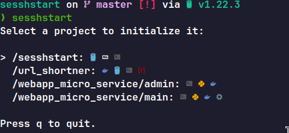

# sesshstart

This tool scans the `~/Project` folder for subprojects and facilitates starting sessions using the `start-session.sh` script. It leverages Go and the Bubble Tea package for efficient navigation and session management.

## Overview

The **Sesshstart** is designed to streamline the process of navigating through multiple subprojects within the `~/Project` directory and quickly initiating sessions for each project using a unified script.



### Features

- **Automatic Detection:** Scans the `~/Project` directory for subprojects.
- **Session Management:** Initiates a session for each project using `start-session.sh`.
- **User-Friendly Interface:** Built with the Bubble Tea package for a smooth interactive experience.

## Requirements

- Go programming language installed. 
- Bubble Tea package installed (`go get github.com/charmbracelet/bubbletea`)

## Installation

1. Clone the repository:

```bash
git clone https://github.com/Sarath191181208/sesshstart
```

2. Go into the project folder 

```bash
cd sesshstart
```

3. Run the project 

```bash
go run .
```

## Configuration

**Customization:** Modify `start-session.sh` to fit your session initiation needs for each project.

Here's an example of how, I use start-session.sh 

```bash
#!/bin/bash 

###### VENV ####### 
# Check if virtual environment is activated
if [ -z "VIRTUAL_ENV" ]
then
    printf "Virtual environment is not activated Use `${BYellow} pipenv ${BIWhite}shell${NC}` command. Exiting..."
    exit 1
fi

###### Docker ####### 
# Check if Docker is running
if ! docker info &> /dev/null
then
    printf "Docker is not running. Exiting..."
    exit 1
fi

SESSIONNAME="sesshstart"

# check for session 
tmux has-session -t SESSIONNAME &> /dev/null
if [ $? != 0 ] 
 then
  # start the new session 
  tmux new-session -d -s SESSIONNAME

  # Window 1: Open nvim on the current project root
  tmux new-window -t SESSIONNAME:1 -n 'nvim'
  tmux send-keys -t SESSIONNAME:1 'nvim' C-m

  # Window 2: Command line window
  tmux new-window -t SESSIONNAME:2 -n 'cmd'

fi

tmux attach -t SESSIONNAME
```

As the `start-session.sh` is a bash script you can also directly open files, applications, etc... With use some commands. 

Happy Hacking 🥳!!

## Extra Examples 

Open chrome 
```bash
# open google chrome localhost:8000
google-chrome-stable localhost:8000 &  # Note: Here & is required to run chrome in a parallel fashion 
```

Run `npm dev` and then open chrome 
```bash 
npm run dev & # '&' for async execution 
google-chrome-stable localhost:5000
```

## Contributing

Contributions are welcome! Feel free to fork the repository and submit pull requests.

## License

This project is licensed under the MIT License - see the [`LICENSE`](LICENSE) file for details.
